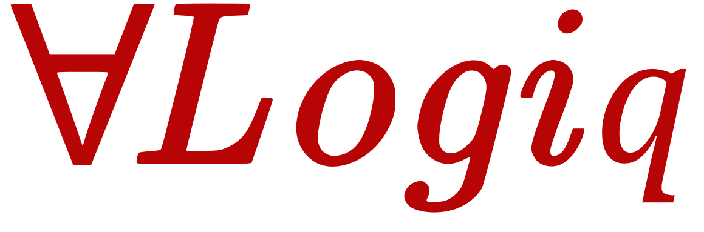

<a id="readme-top"></a>
<div align="center">

</div>

<!-- PROJECT LOGO -->
<br />
<div align="center">
  
  <p align="center">
    <br />
    Logik is a strongly-typed logic interpreter written in Rust.
  </p>
</div>

---

**Logik** is a strongly-typed logic interpreter written in **Rust**, designed to model and evaluate systems based on propositional and first-order logic. It supports the declaration of types, constants, functions, predicates, axioms, and initial facts, and enables the inference of logical truths through deduction.

## Features

- Declarative syntax inspired by formal logic and rule-based systems
- Custom domain types (e.g., `User`, `Role`)
- Typed function and predicate declarations
- First-order quantification (`∀` and `∃`) and standard logical connectives (`->`, `∧`, `∨`, `¬`, etc...)
- Axiomatic reasoning
- Logical query evaluation (true/false)

## Example

```Logik
# Types
User: {alice, bob, charlie}
Role: {admin, client}

# Predicates
isRoleOf: User.Role
isManagerOf: User.User
delegated: User.User
authorized: User
access: User

# Universal axioms
∀u ∈ User, isRoleOf(u, admin) -> authorized(u)
∀u ∈ User, ∀v ∈ User, authorized(u) ∧ delegated(u,v) -> authorized(v)
∀u ∈ User, authorized(managerOf(u)) -> authorized(u)
∀u ∈ User, authorized(u) -> access(u)

# Initialisation
roleOf(alice) := admin
managerOf(charlie) := bob
delegated(alice, bob) := T
authorized(alice) := T
authorized(bob) := T
```

And then we can query the system:

```Logik
query access(alice)
query access(bob)
query authorized(charlie)
query ∃u ∈ User, access(u)
query ∃u ∈ User, access(u) ∧ ¬isRoleOf(u, admin)
```